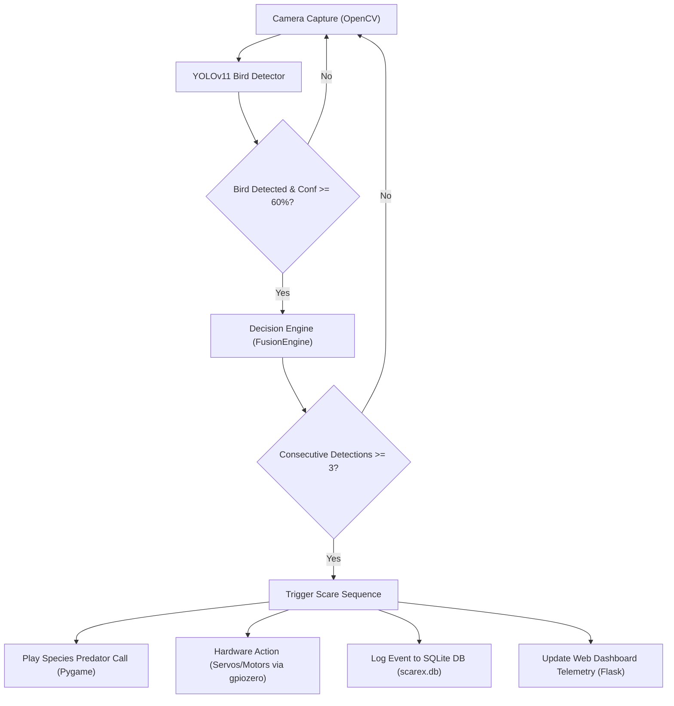

# ScareX: Comprehensive Technical Project Report

**Project Title**: ScareX – AI-Powered Autonomous Bird Protection & Deterrent System  
**Version**: v2.0  
**Target Platform**: Raspberry Pi (Pi 3, Pi 4, Pi 5) / Embedded Linux & Cross-Platform Desktop  
**Date**: September 2026  

---

## 1. Executive Summary & Project Overview

### 1.1 Overview
**ScareX** is an autonomous, AI-driven agricultural robot and monitoring system designed to protect crops (such as paddy, sugarcane, fruits, and grains) from avian damage. Acting as an intelligent, automated scarecrow, ScareX utilizes real-time computer vision to identify specific bird species, evaluate threat thresholds, and execute targeted acoustic and physical deterrent sequences.

### 1.2 The Problem Statement
Traditional agricultural bird deterrence methods present severe limitations:
- **Static Scarecrows**: Birds quickly adapt and learn that traditional scarecrows pose no physical threat.
- **Random Acoustic Deterrents (Gas Cannons/Sirens)**: Create noise pollution, disturb livestock, and cause bird habituation due to repetitive, non-targeted noise.
- **Crop Losses**: Farmers suffer up to 20%–40% seasonal crop loss due to species like Crows, Parakeets, Mynas, Pigeons, and Doves.

### 1.3 The ScareX Solution
ScareX introduces an intelligent, targeted approach:
1. **Targeted Visual Recognition**: Detects specific bird species using state-of-the-art **YOLOv11** object detection.
2. **Species-Specific Acoustic Deterrents**: Plays natural predator calls tailored to the detected species (e.g., Hawk/Eagle calls for Crows, Falcon calls for Mynas).
3. **Physical Countermeasures**: Triggers pan-tilt camera sweeping and wing-flapping motor action.
4. **Live Telemetry & Dashboard**: Exposes a real-time web dashboard for field telemetry, live video streaming, and historical event logging.

---

## 2. System Architecture & Workflow



### 2.1 Workflow Steps
1. **Vision Ingestion**: OpenCV captures frame buffers from the camera at 640x480 resolution.
2. **AI Inference**: YOLOv11 evaluates the frame to detect target bird species (`Crow`, `Common Myna`, `Rose-Ringed Parakeet`, `Peacock`, `Pigeon`, `Dove`, `Sparrow`).
3. **Thresholding & Filtering**: Bounding boxes and confidence scores are computed. Detections under the configured confidence threshold (default `0.60`) are ignored.
4. **Decision Engine**: `FusionEngine` verifies consecutive detections (default `3` frames) to eliminate false triggers from transient objects.
5. **Deterrent Execution**:
   - Matches the detected species to its natural predator call in `config.json`.
   - Plays the audio deterrent via `pygame.mixer`.
   - Activates hardware servos/motors to sweep the area.
6. **Telemetry & Logging**: Records detection details (timestamp, species, confidence, alarm name, source) into SQLite database (`scarex.db`) and streams live annotated video over HTTP MJPEG.

---

## 3. Technology Stack & Justification ("Why We Used This")

| Technology / Component | Version / Specification | Rationale & Justification ("Why We Used This") |
| :--- | :--- | :--- |
| **Python** | `3.9` – `3.13+` | **Core Language**: Provides an unmatched ecosystem for computer vision, machine learning, embedded hardware GPIO access, and rapid development. |
| **YOLOv11 (Ultralytics)** | `>=8.0.0` | **Object Detection**: YOLOv11 nano offers state-of-the-art accuracy with an ultra-lightweight memory footprint (~5.6 MB model size), enabling real-time FPS on Raspberry Pi 3/4/5. |
| **OpenCV (`opencv-python-headless`)** | `>=4.8.0` | **Image & Video Processing**: Industry standard for real-time video buffer capture, color space conversion (BGR to RGB), bounding box visualization, and JPEG frame encoding. |
| **TensorFlow Lite / PyTorch** | `>=2.14.0` | **Edge AI Model Execution**: Quantized TFLite/PyTorch execution ensures low CPU and RAM consumption on embedded single-board computers. |
| **Flask** | `>=3.0.0` | **Web Dashboard Server**: Micro web framework providing fast, non-blocking HTTP REST APIs (`/api/status`, `/api/logs`) and MJPEG video streaming without heavy framework overhead. |
| **Pygame (`pygame.mixer`)** | `>=2.5.0` | **Audio Engine**: Provides reliable, multi-channel, non-blocking audio playback for predator calls across Windows, Linux, and Raspberry Pi OS. |
| **SQLite3** | Native Embedded | **Database Persistence**: Serverless, zero-configuration relational database ideal for embedded systems. Ensures local persistence of all scare logs. |
| **`gpiozero` & `lgpio`** | `>=2.0` | **Hardware Interface**: Modern Python GPIO abstraction layer natively supporting Raspberry Pi 3, 4, and **Raspberry Pi 5 (RP1 controller)** with automatic mock fallback for PC testing. |
| **CustomTkinter & Pillow** | `>=5.2.0` | **Desktop GUI**: Provides sleek, modern dark-themed desktop interface for offline monitoring and manual calibration. |
| **Librosa & Scikit-Learn** | `>=0.10.0` / `>=1.3.0` | **Audio Feature Processing**: Used for extracting Mel-Spectrogram features (128 Mel bands) for bird call classification model training. |

---

## 4. Directory & Folder Structure

```
ScareX_Project/
├── .gitignore                      # Specifies untracked files for Git (DB, cache, logs)
├── DETAILED_PROJECT_REPORT.md      # Comprehensive technical report and stack rationale
├── PROJECT_REPORT.md               # Dedicated report document with full specs
├── PROJECT_EXPLANATION.md          # High-level project summary and workflow breakdown
├── README.md                       # Project quickstart and installation instructions
├── TECH_STACK.md                   # Concise tech stack summary
├── requirements.txt                # Python package dependencies
├── scarex.db                       # Local SQLite database for log persistence
├── yolo11n.pt                      # Pre-trained YOLOv11 weights (5.6 MB)
│
├── assets/                         # Static media assets
│   └── audio/                      # Alarm and sound samples
│
├── config/                         # System configuration files
│   └── config.json                 # Thresholds, GPIO pins, and alarm mapping rules
│
├── dataset/                        # Datasets and preprocessing scripts
│   ├── setup_dataset.py            # Automated dataset downloader/structurer
│   ├── audio_preprocessing.py     # Mel-spectrogram generator for bird audio
│   ├── audio/                      # Raw bird audio samples per species
│   └── images/                     # YOLO dataset split (train/valid/test)
│
├── logs/                           # System and training logs
│   ├── scarex_YYYY-MM-DD.log       # Application log outputs
│   └── yolo_training/              # YOLO model evaluation curves and matrices
│
├── models/                         # Trained machine learning model weights
│   ├── best.pt                     # Custom-trained YOLO bird detection model
│   ├── audio_model_int8.tflite     # Quantized TFLite bird call recognition model
│   ├── audio_model.pkl             # Pickle backup of audio model
│   └── label_encoder.pkl           # Label encoder mapping for audio categories
│
├── src/                            # Main application source code
│   ├── main.py                     # Primary entry point (initializes all modules)
│   ├── demo_run.py                 # Visual demo script for single image detection
│   ├── test_system.py              # System integration test script
│   ├── generate_mock_audio.py      # Utility to generate mock bird audio files
│   ├── generate_mock_vision.py     # Utility to generate test bird images
│   │
│   ├── alerts/                     # Alarm and deterrent player
│   │   └── alert_manager.py        # Plays predator calls mapped to detected species
│   │
│   ├── audio/                      # Audio recognition module
│   │   ├── recognizer.py           # Audio recognizer loop & Mel-spectrogram extractor
│   │   └── trainer.py              # Audio model training pipeline
│   │
│   ├── core/                       # Core system utilities
│   │   ├── config_manager.py       # Thread-safe config loader and JSON reader
│   │   └── logger.py               # Centralized logging format and file handler
│   │
│   ├── dashboard/                  # Flask web dashboard
│   │   ├── app.py                  # Flask server, video stream, and REST endpoints
│   │   └── templates/
│   │       └── index.html          # Web dashboard UI layout & JavaScript frontend
│   │
│   ├── fusion/                     # Core decision engine
│   │   └── fusion_engine.py        # Evaluates camera detections and triggers alarms
│   │
│   ├── hardware/                   # Hardware Abstraction Layer (HAL)
│   │   └── hardware.py             # GPIO controller for servos, motors, and ultrasonic
│   │
│   ├── logging/                    # Database logging service
│   │   └── db_logger.py            # SQLite helper for inserting and querying events
│   │
│   ├── navigation/                 # Autonomous movement logic
│   │   └── navigation.py           # Roaming engine and obstacle avoidance loop
│   │
│   └── vision/                     # Computer vision module
│       ├── detector.py             # YOLOv11 real-time camera inference loop
│       └── trainer.py              # YOLO fine-tuning pipeline
│
├── test_audio.py                   # Standalone audio recognition test script
└── test_vision.py                  # Standalone YOLO vision detection test script
```

---

## 5. Hardware Integration & Deployment

### 5.1 Hardware Components
- **Single Board Computer**: Raspberry Pi 5 / Pi 4 / Pi 3.
- **Camera**: Raspberry Pi Camera Module v2/v3 or standard USB Webcam.
- **Audio Output**: 3.5mm AUX Speaker or USB Amplifier.
- **Microphone**: USB Omnidirectional Microphone.
- **Motor Driver**: L298N H-Bridge Dual DC Motor Driver.
- **Servos**: SG90 / MG996R Servos for Pan-Tilt Camera Sweep.
- **Distance Sensor**: HC-SR04 Ultrasonic Sensor for obstacle detection.

### 5.2 Raspberry Pi 5 Compatibility
- Uses `gpiozero` which automatically communicates with the Pi 5's new **RP1 I/O Controller**.
- Fully compatible with 64-bit **Raspberry Pi OS (Bookworm)**.
- Achieves **20–30 FPS** real-time vision inference on Pi 5 CPU without requiring external accelerators.

---

## 6. How to Run the System

### 6.1 Install Dependencies
```bash
pip install -r requirements.txt
```

### 6.2 Test Individual Modules
- **Test Vision Detection**:
  ```bash
  python test_vision.py
  ```
- **Test Audio Recognition**:
  ```bash
  python test_audio.py
  ```

### 6.3 Launch Complete ScareX Application
```bash
python -m src.main
```
- Open your browser and navigate to `http://localhost:5000` to view the live dashboard and real-time detection telemetry.

---

## 7. Conclusion
ScareX combines modern edge computer vision (YOLOv11), hardware control, and species-targeted predator audio deterrents into an open-source, affordable package. By replacing continuous random noise with targeted, visual-first activation, ScareX prevents bird habituation, minimizes noise pollution, and provides farmers with an automated crop protection solution.
